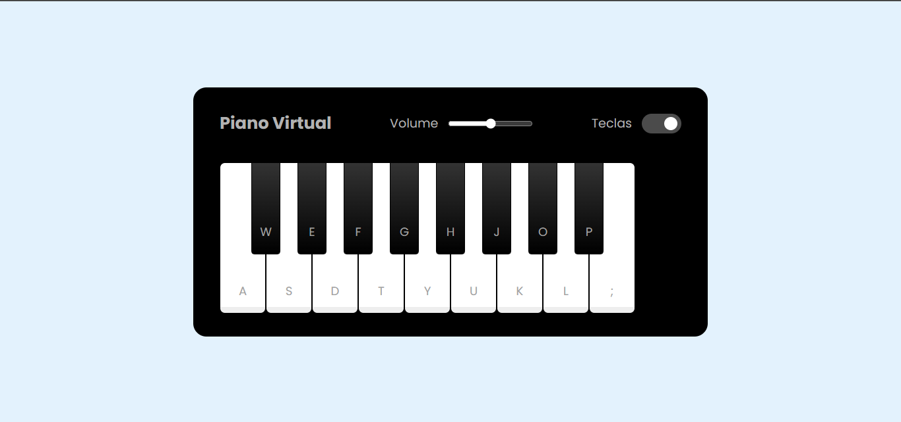

# PROJETO SIMULADOR DE PIANO

> Projeto foi desenvolvido durante o Bootcamp Potência Tech Ifood - desenvolvimento de jogos, em parceria com a DIO e consiste no desenvolvimento de um simulador de piano.

### Ajustes e melhorias

O projeto está finalizado mas aberto a críticas, elogios e sugestões.

## 💻 Pré-requisitos

Antes de começar, verifique se você atendeu aos seguintes requisitos:

- Um navegador instalado

## ☕ Utilizando o Simulador de Piano:

Para utilizar o Simulador de Piano siga estas etapas:

- Abra o link: https://maurochavesjr.github.io/simulador-piano/

## 🤝 Colaboradores

Agradecemos às seguintes pessoas que contribuíram para este projeto:

<table>
  <tr>
    <td align="center">
      <a href="#" title="defina o titulo do link">
         
        
          <b>Mauro Chaves</b>
        
      </a>
    </td>
  </tr>
</table>

